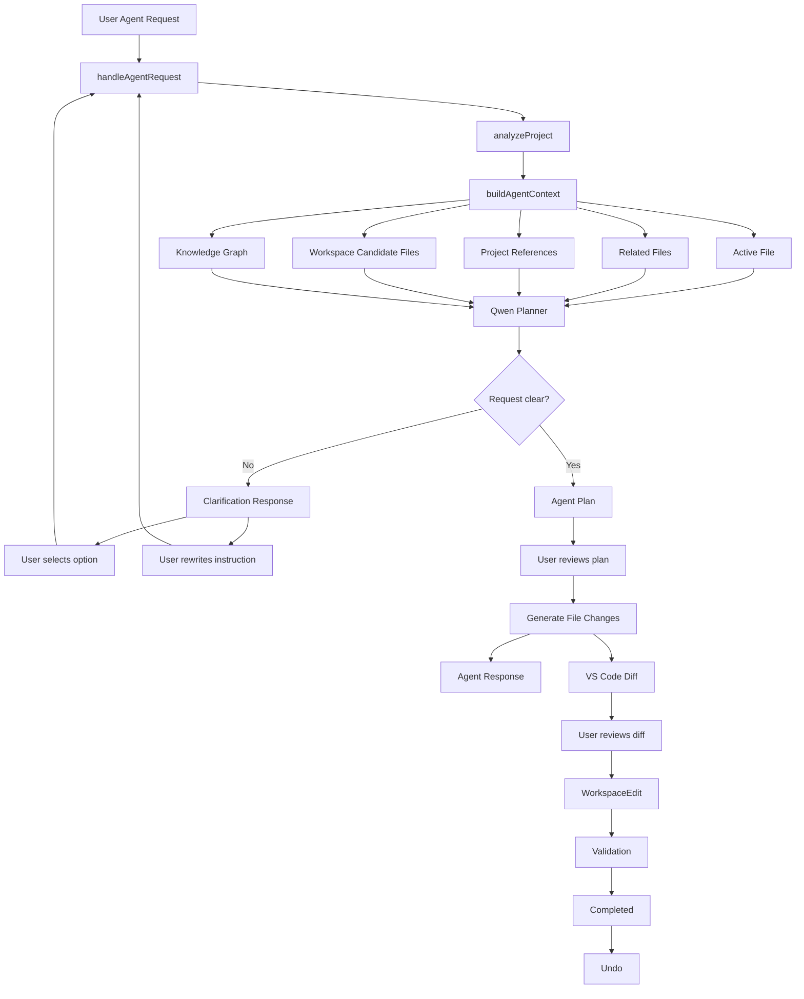
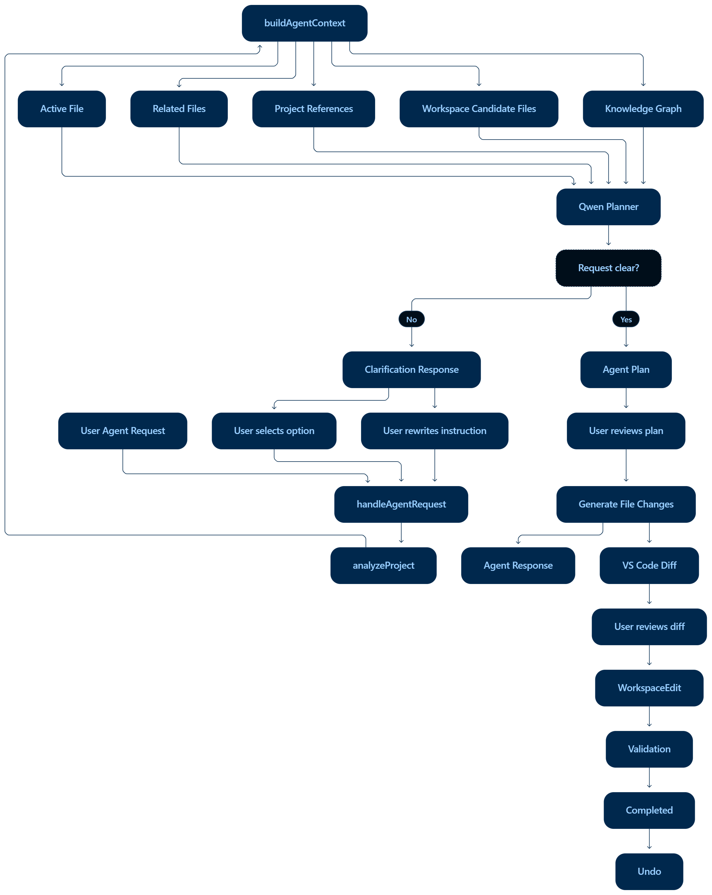
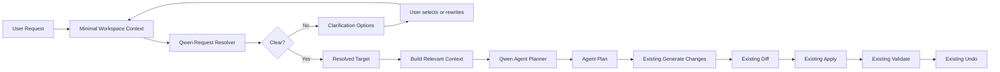

```mermaid
graph TD
    A[User Agent Request] --> B[handleAgentRequest]
    B --> C[analyzeProject]
    C --> D[buildAgentContext]

    D --> E[Active File]
    D --> F[Related Files]
    D --> G[Project References]
    D --> H[Workspace Candidate Files]
    D --> I[Knowledge Graph]

    E --> J[Qwen Planner]
    F --> J
    G --> J
    H --> J
    I --> J

    J --> K{Request clear?}

    K -->|No| L[Clarification Response]
    L --> M[User selects option]
    L --> N[User rewrites instruction]

    M --> B
    N --> B

    K -->|Yes| O[Agent Plan]
    O --> P[User reviews plan]
    P --> Q[Generate File Changes]
    Q --> R[Agent Response]
    Q --> S[VS Code Diff]
    S --> T[User reviews diff]
    T --> U[WorkspaceEdit]
    U --> V[Validation]
    V --> W[Completed]
    W --> X[Undo]
```

```mermaid
graph LR
  A[User Request] --> B[Minimal Workspace Context]
  B --> C[Qwen Request Resolver]
  C --> D{Clear?}
  D -->|No| E[Clarification Options]
  E --> F[User selects or rewrites]
  F --> B
  D -->|Yes| G[Resolved Target]
  G --> H[Build Relevant Context]

  H --> I[Qwen Agent Planner]
  I --> J[Agent Plan]
  J --> K[Existing Generate Changes]
  K --> L[Existing Diff]
  L --> M[Existing Apply]
  M --> N[Existing Validate]
  N --> O[Existing Undo]
```
